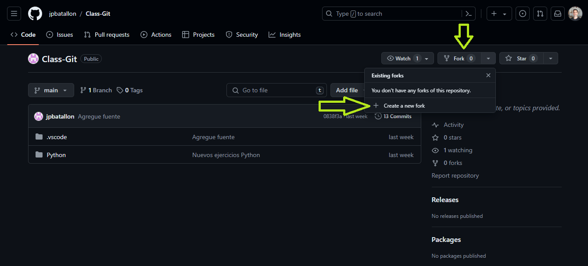

### Para colaborar

Para contribuir en éste proyecto lo primero que debemos hacer es:

1. Fork del Repositorio

- Primero vamos hacer un fork del repositorio original, esto crea una copia en del repo en nuestra cuenta de github. Dirígete al repositorio que deseas forkar. Puedes buscar el repositorio utilizando la barra de búsqueda en la parte superior de la página o navegando directamente a su URL.

- Una vez que estés en la página del repositorio, busca el botón que dice "Fork" en la esquina superior derecha de la página, justo debajo de tu foto de perfil.



2. Clonar el Repositorio Forkeado

- Una vez que has forkeado el repositorio vamos clonar ésta url desde nuestra consola de GitBash:

```bash
git clone https://github.com/solidsnk86/tp-pseint-utn.git
```

3. Crear una Rama y Hacer Cambios

- Crea una nueva rama para tus cambios. Es una buena práctica nombrar la rama de acuerdo a la funcionalidad o el arreglo que estés implementando, también podemos usar nuestros nombres para identificarnos en este TP.

```bash
git checkout -b nombre-de-la-rama
```

4. Realizar Cambios y Hacer Commits

- Realiza los cambios necesarios en el código y realiza commits frecuentemente con mensajes descriptivos.

```bash
git add .
git commit -m "Descripción de los cambios"
```

5. Subir la Rama al Repositorio Forkeado

- Sube la rama a tu repositorio forkeado en GitHub.

```bash
git push origin nombre-de-la-rama
```

6. git push origin nombre-de-la-rama

- En GitHub, vamos a nuestro repositorio forkeado y encontrarás un botón para crear un nuevo pull request. Sigue las instrucciones para solicitar la incorporación de tus cambios en el repositorio original.

>[!Importante]
>Para poder hacer un paste en la consola de git bash después de haber copiado algo vamos a usar (<b>shift</b> + <b>Insert</b>).

### Resumen del Flujo

1. Fork el repositorio original en GitHub.
2. Clonamos el repositorio forkeado a tu máquina local.
3. Crea una nueva rama para tus cambios.
4. Realizar cambios y hacer los commits.
5. Sube la nueva rama al repositorio forkeado.
6. Crea un pull request para solicitar la incorporación de tus cambios.
